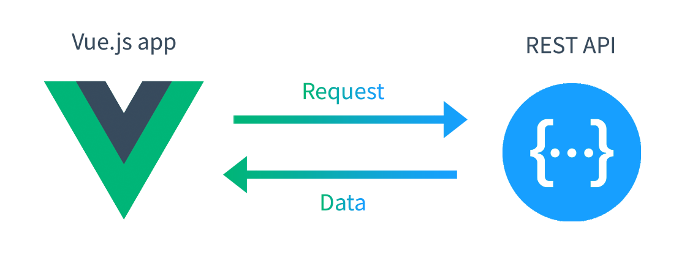

## The end result

The end result should have the following routes/components:

| Page | Component | Description |
|------|------|------|
| `/` | `AllTeams.vue` | This will display all team names, when you click on one it will take you to `/team/{TEAM_ID}` (below)
| `/team/{TEAM_ID}` | `TeamInfo.vue` | This will display team info, all players and games played for the specified team (this can be either a URL parameter (`team/:XXX`) or query string (`?team_id=XXX`))
| - | `PlayerStats.vue` | This will display information about a specified player. |

You can have each component as a separate page, or have them show/hide when necessary, either on one page or via a modal (or similar).

## The basic functionality required:
1. Create the Vue routes to render different components to the page.
2. Get all the teams and present the information on a page via a component.
3. Create the functionality to click on a team and display the players and games for that team via a component.
4. Create the functionality to add a new game result for a team (see API end points).
5. Create the functionality to click on a player and display their playing club history.

## Bonus points:
1. Show the club logo image in the team page as well as the background colour for the team.
2. Display all the dates and amounts in the right format (dd/mm/yy and xxx,xxx,xxx.xx).
3. Build a filter that allows you to search for players by any field.
4. Calculate the total goals and points for each team (being the points calculated as 3 for a victory, 1 for a tie and 0 for a loss).


## The Rules

1. You can install any package or use any external source you like.
2. You must use Vue.js, you cannot use jQuery.
3. You can add any styles you wish, SCSS preferred.
4. You have to make a single page application using Vue.js router.
5. You can use es5, es6 or es7.

## To Start App

``` bash
# install dependencies
npm install

# starts local server with hot reloading at localhost:8080
npm run start

```

## How the app works



_* You only have to work in the Vue App front-end, all functionality is already done in the API_

For a detailed explanation on Vue.js, check out the [Vue Documentation](https://vuejs.org/v2/guide/).

## API

> We recommend using HTTP request software (such as Postman or Insomnia) to test out the endpoint request/responses.

[Download Postman](https://www.getpostman.com/)

[Download Insomnia](https://insomnia.rest/)


##### All data should be assumed to be sent in the POST body (wrapped inside a JSON object) with the following headers:

| Header | Value |
| --- | --- |
| `Content-Type` | `application/json` |

#### Get Teams
##### `/api/teams` [ POST ]

Optional Body Parameters:

| Name | Type | Example |
|---|---|---|
| `team_id` | UUID | `3097fe71-57da-4c84-8efd-33bb9bae9d21` |
| `name` | String | `Benfica` |
| `city` | String | `Lisboa` |
| `logo_url` | String | `https://upload.wikimedia.org/wikipedia/en/thumb/a/a2/SL_Benfica_logo.svg/220px-SL_Benfica_logo.svg.png` |
| `founded` | String | `1904` |
| `colour` | String | `ef2c20` |
| `budget` | Number | `24750000` |

Example Response:
```
{
    "success": true,
    "data": [
        {
            "id": "b349094d-d51c-48d8-bb1d-7ca4f571ea89",
            "name": "Manchester United",
            "city": "Manchester",
            "logo_url": "https://upload.wikimedia.org/wikipedia/en/thumb/7/7a/Manchester_United_FC_crest.svg/220px-Manchester_United_FC_crest.svg.png",
            "founded": "1878",
            "colour": "red",
            "budget": "75000000"
        }
    ]
}
```

#### Get Players
##### `/api/teams/players` [ POST ]

Optional Body Parameters:

| Name | Type | Example |
|---|---|---|
| `team_id` | UUID | `3097fe71-57da-4c84-8efd-33bb9bae9d21` |
| `name` | String | `Rex Berry` |
| `age` | Integer | `33` |
| `nationality` | String | `England` |
| `position` | String | `FW` |

Example Response:
```
{
    "success": true,
    "data": [
        {
            "id": "bd352bc3-6c09-4333-97f3-597de9af3b5a",
            "team_id": "00d7cb66-b3c6-4e90-8871-19b99c5c5078",
            "name": "Buddy Alphonse",
            "age": 29,
            "nationality": "Ireland",
            "flag_url": "https://upload.wikimedia.org/wikipedia/commons/thumb/4/45/Flag_of_Ireland.svg/125px-Flag_of_Ireland.svg.png",
            "position": "GK",
            "history": [
                {
                    "team_id": "3097fe71-57da-4c84-8efd-33bb9bae9d21",
                    "apps": 9,
                    "goals": 15
                }
            ],
            "value": "923332"
        }
    ]
}
```

#### Get Games
##### `/api/teams/games` [ POST ]

Optional Body Parameters:

| Name | Type | Example |
|---|---|---|
| `date` | DateTime | `2018-08-04T07:41:55.172Z` (4th Aug '18) |
| `team_one_id` | UUID | `3097fe71-57da-4c84-8efd-33bb9bae9d21` |
| `team_one_goals` | Integer | `0` |
| `team_two_goals` | Integer | `0` |

Example Response:
```
{
    "success": true,
    "data": [
        {
            "id": "901eb39d-082c-42e8-a07c-6ba8d71cc32b",
            "date": "2018-08-04T07:41:55.172Z",
            "team_one_id": "59d6e27e-685c-48a3-8d31-c546efcda0f0",
            "team_one_goals": 2,
            "team_two_goals": 4
        }
    ]
}
```

#### Add a Game
##### `/api/teams/games/new` [ POST ]

Required Body Parameters:

| Name | Type | Example |
|---|---|---|
| `date` | DateTime | `2018-08-04T07:41:55.172Z` (4th Aug '18) |
| `team_one_id` | UUID | `59d6e27e-685c-48a3-8d31-c546efcda0f0` |
| `team_one_goals` | Integer | `2` |
| `team_two_goals` | Integer | `4` |

Example Response:
```
{
    "success": true,
    "result": [
        {
            "id": "0e7b8071-d340-432e-b6b3-67d5d22c643f",
            "date": "2018-08-04T07:41:55.000Z",
            "team_one_id": "59d6e27e-685c-48a3-8d31-c546efcda0f0",
            "team_one_goals": 2,
            "team_two_goals": 4
        }
    ]
}
```
